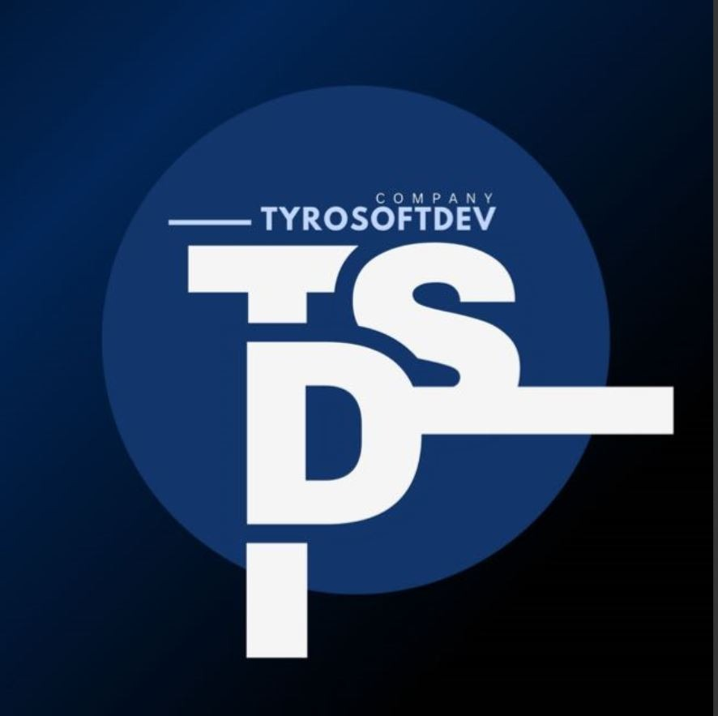

<div align="center">
  
  <h1>TYROSOFT DEV</h1>
  <p><strong>Custom Software Engineering &amp; AI Automation for Ambitious Businesses</strong></p>
  <p>📍 Islamabad, Pakistan | 📞 +92 307 5357545 | ✉️ contact@tyrosoftdev.com</p>

  <p>
    <a href="https://tyrosoftdev.com"></a>
    <a href="#-tech-stack"></a>
    <a href="#-tech-stack"></a>
    <a href="#-tech-stack"></a>
  </p>
</div>

---

## 📖 About Tyrosoft Dev

**Tyrosoft Dev** is a high-performance software startup based in **Islamabad, Pakistan**. We engineer custom web applications, mobile platforms, dark editorial visual identity systems, and autonomous AI workflow automations that help businesses reduce manual operational costs by up to 60%.

This repository contains the complete production-ready marketing website built with **Next.js 15 (App Router)**, **TypeScript**, **Tailwind CSS**, and **Framer Motion**.

---

## ✨ Key Features & Highlights

- 🎨 **Dark Editorial Aesthetic**: Deep near-black background (`#07050B`), dark card surfaces (`#0F0B16`), and exact brand purple (`#6D28D9`) highlights.
- ⚡ **Sub-Second Performance**: Next.js App Router, Server Components, and optimized image delivery yielding a 95+ Lighthouse performance target.
- 🤖 **AI Automation Spotlight**: Interactive before/after operational cost comparison showcasing automated RAG and LLM agent workflows.
- 🛠️ **8 Core Capabilities**: Dedicated detailed sections for:
  1. **AI Automation for Businesses**
  2. **Web Development (Next.js)**
  3. **App Development (iOS & Android)**
  4. **Graphic Design & Brand Systems**
  5. **Video Editing & Motion Graphics**
  6. **Growth Marketing Strategy**
  7. **IT Support & Cloud Consulting**
  8. **Free Strategic Consultation**
- 💼 **Filterable Work Portfolio**: Filter case studies by category (`Web`, `App`, `Design`, `Video`, `Automation`) with interactive project detail modals.
- 📬 **Free Consultation Form**: Production contact form with client-side validation and instant email dispatching via **Web3Forms** (routed directly to `muneebsaleem402@gmail.com`).
- 🎯 **SEO & Accessibility**: Complete metadata per page, OpenGraph tags, JSON-LD `Organization` schema, `sitemap.xml`, `robots.txt`, and full support for `prefers-reduced-motion`.

---

## 🛠️ Tech Stack

| Category          | Technologies                                                            |
| :---------------- | :---------------------------------------------------------------------- |
| **Framework**     | [Next.js 15](https://nextjs.org/) (App Router & Server Components)      |
| **Language**      | [TypeScript](https://www.typescriptlang.org/)                           |
| **Styling**       | [Tailwind CSS](https://tailwindcss.com/) & Vanilla CSS Tokens           |
| **Animations**    | [Framer Motion](https://www.framer.com/motion/)                         |
| **Icons**         | [Lucide React](https://lucide.dev/)                                     |
| **Typography**    | `Space Grotesk` (Display), `Inter` (Body), `JetBrains Mono` (Badges)    |
| **Form Dispatch** | [Web3Forms API](https://web3forms.com/) (100% Free Live Email Delivery) |

---

## 📂 Repository Structure

```tree
TyrosoftDev/
├── public/                  # Favicons, logo.png, logo.svg & static assets
│   ├── logo.png             # Official Tyrosoft Dev brand logo
│   ├── favicon.ico          # Browser tab icon
│   └── apple-icon.png       # iOS home screen icon
├── src/
│   ├── app/                 # Next.js App Router pages & endpoints
│   │   ├── layout.tsx       # Root layout with fonts, SEO & JSON-LD
│   │   ├── page.tsx         # Home page (9 dark editorial sections)
│   │   ├── services/        # 8 Detailed capability blocks
│   │   ├── work/            # Filterable portfolio & modal view
│   │   ├── about/           # Mission, story & values
│   │   ├── contact/         # Booking form & consultation details
│   │   ├── api/contact/     # Contact route handler (Web3Forms/Resend)
│   │   ├── sitemap.ts       # Dynamic sitemap generator
│   │   └── robots.ts        # Crawler directives
│   ├── components/          # Modular UI components
│   │   ├── ui/              # Button, SpotlightCard, Reveal, Badge, Accordion
│   │   ├── layout/          # Navbar & Footer
│   │   ├── home/            # Hero, Bento Grid, AI Spotlight, Case Studies
│   │   ├── work/            # WorkGrid & Project Modal
│   │   └── contact/         # ContactForm component
│   ├── data/                # Typed content files
│   │   ├── company.ts       # Company contact info & stats
│   │   ├── services.ts      # 8 Service definitions
│   │   ├── projects.ts      # Case studies dataset
│   │   ├── testimonials.ts  # Client quotes & feedback
│   │   └── faqs.ts          # Frequently asked questions
│   └── lib/                 # Utility helpers (cn class merger)
├── .env                     # Web3Forms API key & receiver email
├── README.md                # Project documentation
└── package.json             # NPM dependencies & scripts
```

---

## 🚀 Getting Started

### 1. Clone & Install

```bash
git clone https://github.com/tyrosoftdev/tyrosoftdev.git
cd TyrosoftDev
npm install
```

### 2. Environment Setup

The `.env` file is pre-configured with Web3Forms live email dispatching:

```env
WEB3FORMS_ACCESS_KEY=Your Key
NEXT_PUBLIC_WEB3FORMS_ACCESS_KEY= Your Key
CONTACT_RECEIVER_EMAIL=your email address
```

### 3. Run Development Server

```bash
npm run dev
```

Open [http://localhost:3000](http://localhost:3000) in your browser to view the live website.

---

## 🚢 Production Build & Vercel Deployment

### Build Locally

To test the production build locally:

```bash
npm run build
npm run start
```

### Deploying to Vercel

1. Push this repository to GitHub.
2. Import the repository into your [Vercel Dashboard](https://vercel.com/new).
3. Vercel automatically detects Next.js. Click **Deploy**.
4. Your website will be live globally in less than 2 minutes with automatic SSL and CDN caching.

---

## 📞 Contact & Support

- **Email**: [contact@tyrosoftdev.com](mailto:contact@tyrosoftdev.com)
- **Phone**: [+92 307 5357545](tel:+923075357545)
- **Location**: Islamabad, Pakistan

© 2026 **Tyrosoft Dev LLC**. All rights reserved.
